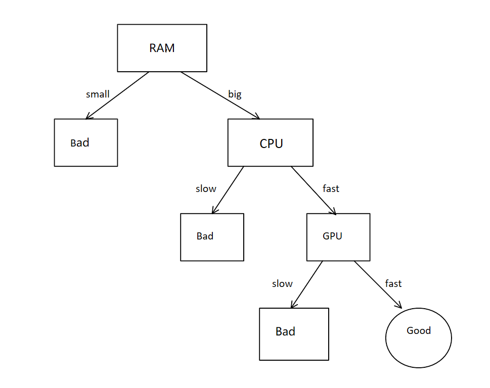

# Decision Tree

Author: Zhang Xiaozheng Date: 2019/10/20

## What is Decision Tree

  First, let's see the definition of the decision tree on [Wiki]( https://en.wikipedia.org/wiki/Decision_tree ).

> A **decision tree** is a [decision support](https://en.wikipedia.org/wiki/Decision_support_system) tool that uses a [tree-like](https://en.wikipedia.org/wiki/Tree_(graph_theory)) [model](https://en.wikipedia.org/wiki/Causal_model) of decisions and their possible consequences, including [chance](https://en.wikipedia.org/wiki/Probability) event outcomes, resource costs, and [utility](https://en.wikipedia.org/wiki/Utility). It is one way to display an [algorithm](https://en.wikipedia.org/wiki/Algorithm) that only contains conditional control statements.
>
> Decision trees are commonly used in [operations research](https://en.wikipedia.org/wiki/Operations_research), specifically in [decision analysis](https://en.wikipedia.org/wiki/Decision_analysis), to help identify a strategy most likely to reach a [goal](https://en.wikipedia.org/wiki/Goal), but are also a popular tool in [machine learning](https://en.wikipedia.org/wiki/Decision_tree_learning).

  The decision tree is a way to do the classification. It works just like a human being. For example, when you want to know whether a computer is a good computer, you may first look at the RAM of this computer and then the CPU and then the GPU and so on. If we represent this process with a tree, we may do this:

  First, we check the RAM of this computer, if it doesn't have large RAM, we think this computer isn't a good computer. If it has large RAM, we continue to check the CPU and so on.

  So, if we can generate a tree like this from a data set, we can let the machine do the classification job based on this tree just like us. This is the basic idea of the decision tree.

## How to create a decision tree
<<<<<<< HEAD
  When we want to create a decision tree, the first thing we need to think is how to choose the feature on each node. To solve this question, we need to know information entropy and information gain.

- Information entropy

  For a given set ***D*** which has ***|y|*** classes, the proportion of the ***k-th*** class in set ***D*** is  
  $$
  p_k\ \ \ (k = 1,2,3......|y|)
  $$
  The entropy of the set ***D*** is:

$$
Ent(D)=-\sum_{k=1}^{|y|}p_k log_2(p_k)
$$

- Information gain

  Suppose a feature ***a*** has ***V*** different types which is:
  $$
  \{a^1,a^2,......,a^v\}
  $$
  

  If we split the set ***D*** by feature ***a***, we will have ***v*** subsets. Each subsets has 
  $$
  |D^v|
  $$
  elements and the set ***D*** has ***|D|*** elements, so the information gain is:
  $$
  Gain(D,a)=Ent(D)-\sum_{v=1}^{V}\frac{|D^v|}{|D|}\  Ent(D^v)
  $$

So we can choose the feature which makes the information gain largest to split the set ***D*** . This is the ***ID3*** algorithm. 

But there is some problem with the ***ID3*** algorithm. For example, if we use the ID number of people in a training data as a feature, because everyone has a different ID number, the information gain of this feature will be very large, but the ID number may has nothing to do with the answer. To solve this problem, we can use the gain ratio to split the set ***D*** .

- Gain ratio
=======
  When we want to create a decision tree, the first thing we need to think about is how to choose the feature on each node. To solve this question, we need to know the entropy of information.
>>>>>>> fb2b25d6831984ab563e54f7b26c63e7335cd7fa
